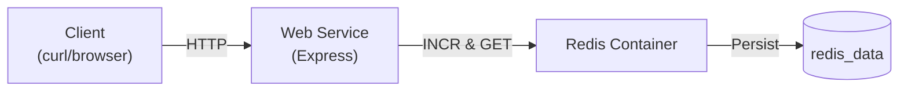

# DevOps Project

A containerized Node.js web service with Redis-backed persistence, orchestrated via Docker Compose.

---

## Table of Contents

1. [Objective](#objective)
2. [Features](#features)
3. [Prerequisites](#prerequisites)
4. [Project Structure](#project-structure)
5. [Setup & Running](#setup--running)

   * [1. Docker Compose](#1-docker-compose)
   * [2. Local Development](#2-local-development)
6. [API Endpoints](#api-endpoints)
7. [Environment Variables](#environment-variables)
8. [Branch Protection Rules](#branch-protection-rules)
9. [Evaluation Criteria](#evaluation-criteria)
10. [Bonus: Architecture Diagram](#bonus-architecture-diagram)

---

## Objective

Build a GitHub-hosted project that demonstrates:

1. **GitHub**

   * Protected `main` branch (PRs required, ≥ 1 approval, conversation resolution).
2. **Web Service**

   * Express.js API for managing tasks.
3. **Redis Integration**

   * Redis as the storage backend with a Docker volume for persistence.
4. **Docker Compose**

   * Single `docker-compose.yml` to orchestrate both web service and Redis.
5. **Documentation**

   * Clear `README.md` with run instructions, architecture, and bonus diagram.

---

## Features

* **Express.js** REST API under `/tasks`
* **Redis** for task storage, auto-incrementing IDs
* **Docker** containerization of web service + Redis
* **Docker Compose** for one-command setup (`up` / `down`)
* **Persistent Data** via Docker volume `redis_data`
* **GitHub** branch protection enforced on `main`
* **Bonus:** Mermaid architecture diagram

---

## Prerequisites

* [Docker](https://www.docker.com/)
* [Docker Compose](https://docs.docker.com/compose/)
* (Optional) [Node.js](https://nodejs.org/) & `npm` for local development
* (Optional) `redis-server` for running Redis locally

---

## Project Structure

```text
devops-project/
├── .gitignore
├── docker-compose.yml
├── README.md
└── web-service/
    ├── Dockerfile
    ├── package.json
    ├── package-lock.json
    └── src/
        └── index.js
```

---

## Setup & Running

### 1. Docker Compose

From the project root:

```bash
docker-compose up --build
```

* **`devops_redis`** container runs Redis on port `6379`.
* **`devops_web`** container runs the API on port `3000`.
* Data persists in the named volume `redis_data`.

To stop and remove:

```bash
docker-compose down
```

### 2. Local Development

1. Install dependencies:

   ```bash
   cd web-service
   npm install
   ```

2. (If not using Docker) start Redis locally:

   ```bash
   redis-server
   ```

3. Run the service:

   ```bash
   npm start
   ```

4. Access at: `http://localhost:3000`

---

## API Endpoints

All endpoints consume and produce JSON.

### Create a Task

```http
POST /tasks
Content-Type: application/json

{ "text": "Buy milk" }
```

**Response (201 Created):**

```json
{ "id": 1, "text": "Buy milk" }
```

### List All Tasks

```http
GET /tasks
```

**Response (200 OK):**

```json
[
  { "id": 1, "text": "Buy milk" },
  { "id": 2, "text": "Walk dog" }
]
```

### Delete a Task

```http
DELETE /tasks/1
```

**Response (200 OK):**

```json
{ "deleted": "1" }
```

---

## Environment Variables

* `PORT` — port for the web service (default: `3000`)
* `REDIS_URL` — Redis connection string

  * Local dev default: `redis://localhost:6379`
  * Docker Compose override: `redis://redis:6379`

---

## Branch Protection Rules

Configure on **GitHub → Settings → Branches** for `main`:

1. Require pull requests before merging
2. Require at least **1** approving review
3. Require conversation resolution before merge

---

## Evaluation Criteria

* **Repository Configuration** (5%)
* **Pull Requests** (20%)
* **Merged PRs** (5%)
* **Functionality** (40%)
* **Docker Files** (10%)
* **Documentation** (10%)
* **Data Persistence** (5%)
* **Project Organization** (5%)
* **Bonus Diagram** (10%)

---

## Bonus: Architecture Diagram



---

**Congratulations!** You now have a fully containerized DevOps project with Redis persistence and comprehensive documentation.
